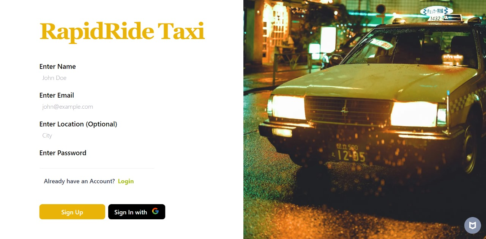
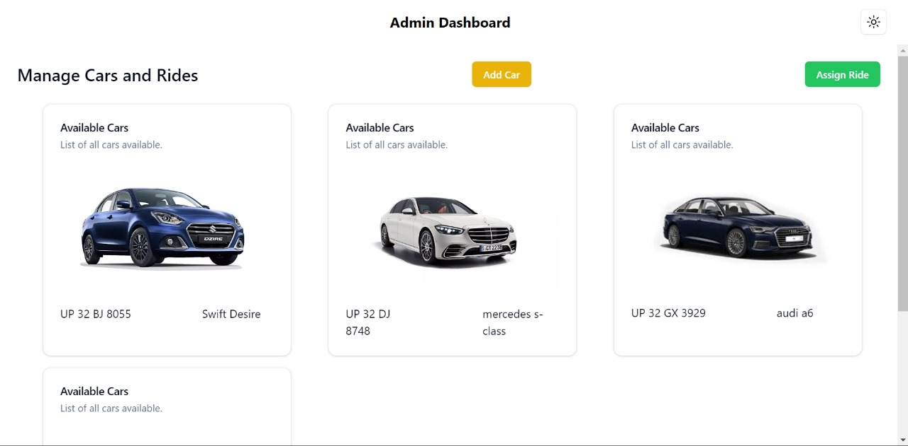

# rapidRide

rapidRide is a taxi application designed to streamline the process of assigning available cars to drivers. Administrators can add new cars to the system, assign cars to drivers, and manage driver requests. Drivers have the ability to accept or decline ride requests. The application is built using Next.js, TypeScript, and Firebase, offering a robust and scalable solution for managing taxi services.

[Video Link](https://drive.google.com/drive/folders/1UDBGEEKjhfaYuz-BEL2ZDL371nqo5Ya1?usp=sharing)


## Table of Contents

- [Features](#features)
- [Tech Stack](#tech-stack)
- [Installation](#installation)
- [Usage](#usage)
- [Contributing](#contributing)
- [License](#license)
- [Contact](#contact)




## Features

- **Admin Panel**:
  - Add new cars to the system.
  - Assign cars to available drivers.
- **Driver Interface**: Accept or decline ride requests.
- **Real-time Updates**: Keep the driver and admin dashboard updated in real time.
- **Scalable Architecture**: Built with scalability in mind using Firebase.

## Tech Stack

- **Next.js**: Framework for building server-side rendered React applications.
- **TypeScript**: Typed superset of JavaScript that compiles to plain JavaScript.
- **Firebase**: Backend-as-a-Service (BaaS) providing various services like Authentication, Realtime Database, and Cloud Functions.

## Installation

1. **Clone the Repository**
   ```bash
   git clone https://github.com/yourusername/rapidRide.git
   ```

2. **Navigate to the Project Directory**
   ```bash
   cd rapidRide
   ```

3. **Install Dependencies**
   ```bash
   npm install
   ```

4. **Configure Firebase**
   - Go to your [Firebase Console](https://console.firebase.google.com/).
   - Create a new project.
   - Set up Authentication, Realtime Database, and any other required services.
   - Copy the Firebase config object and paste it into a `.env.local` file in your project directory.
     ```env
     NEXT_PUBLIC_FIREBASE_API_KEY=your-api-key
     NEXT_PUBLIC_FIREBASE_AUTH_DOMAIN=your-auth-domain
     NEXT_PUBLIC_FIREBASE_PROJECT_ID=your-project-id
     NEXT_PUBLIC_FIREBASE_STORAGE_BUCKET=your-storage-bucket
     NEXT_PUBLIC_FIREBASE_MESSAGING_SENDER_ID=your-messaging-sender-id
     NEXT_PUBLIC_FIREBASE_APP_ID=your-app-id
     ```

5. **Start the Development Server**
   ```bash
   npm run dev
   ```

6. **Open Your Browser**
   - Visit [http://localhost:3000](http://localhost:3000) to see the application in action.

## Usage



- **Admin**:
  - Log in to the admin panel.
  - Add new cars to the fleet.
  - View available cars and drivers.
  - Assign cars to drivers.

- **Driver**:
  - Log in to the driver dashboard.
  - View assigned car details.
  - Accept or decline ride requests.

  